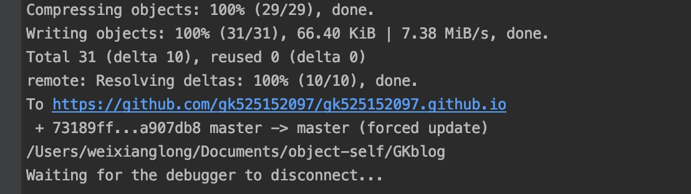

# 使用vuepress搭建静态博客

## 一、vueprss环境安装

>npm i vuepress@next -g

## 二、项目搭建
>1、建立文件夹 \
>2、搭建vuepress项目 npm reacte vuepress \
>3、这里选择的是 docs 模式 \
>4、完成vuepress的项目搭建


## 三、部署到github上
> 1、在github上建立一个 username.github.io 的库 username为自己的github账户 \
> 2、项目里在package.json同级目录下建立 deploy.sh 文件
```js
deploy.sh文件内容
#!/usr/bin/env sh

# 确保脚本抛出遇到的错误
set -e

# 生成静态文件
npm run build

# 进入生成的文件夹
cd docs/.vuepress/dist

git init
git add -A
git commit -m 'deploy'

# 如果发布到 https://<USERNAME>.github.io  填写你刚刚创建的仓库地址
git push -f https://github.com/<USERNAME>/<USERNAME>.github.io master

cd -
```
> 3、项目package.json文件里 添加 启动命令
````js
  "scripts": {
    "dev": "vuepress dev docs",
    "build": "vuepress build docs",
    "deploy": "bash deploy.sh" // 新增的命令
  },
````
> 4、 运行 npm run deploy



> 5、 https:// ${USERNAME}  .github.io 访问
